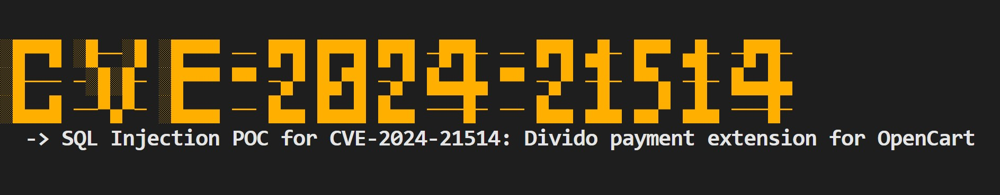

# CVE-2024-21514 PoC and Bulk Scanner




## Overview

POC for CVE-2024-21514 : SQL Injection issue was identified in the Divido payment extension for OpenCart, which is included by default in version 3.0.3.9

This POC is create by [M Ali](https://x.com/MohamedNab1l) and it's based on this [Security Advisory by Snyk](https://security.snyk.io/vuln/SNYK-PHP-OPENCARTOPENCART-7266565).


## How to Use

### Minimum Requirements

- Python 3.6 or higher
- `requests` library

### Single Target Scan

To scan a single target endpoint:
```sh
python cve-2024-21514 .py -u target
```

### Bulk Target Scan
To mass scan bulk targets:
```sh
python cve-2024-21514 .py -f targets.txt
```

## Contacts
Get in touch with me if you have any questions or recomendations.


## Disclaimer

I like to create my own tools for fun and educational purposes only. I 'm releasing this tool is for educational use only. I do not support or encourage hacking or unauthorized access to any system or network. Please use this tool responsibly and only on systems where you have clear permission to test. You are responsible for any misuse.

## References

- https://github.com/xwiki/xwiki-platform/security/advisories/GHSA-2858-8cfx-69m9
- https://nvd.nist.gov/vuln/detail/CVE-2024-21514 
